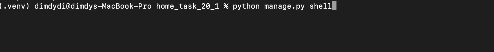
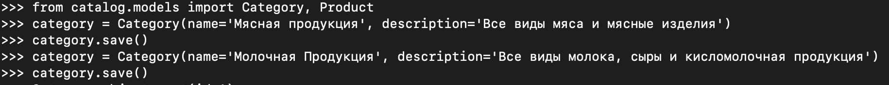
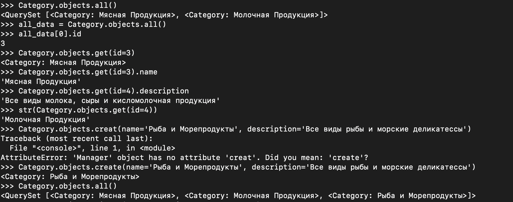
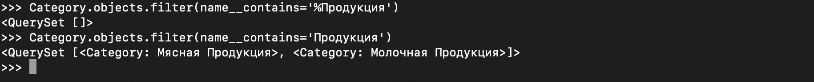

# Домашнее задание #20_1

Продолжайте работу в проекте предыдущей домашней работы.

## Задание 1

Подключите СУБД PostgreSQL для работы в проекте, для этого:

- Создайте базу данных в ручном режиме.
- Внесите изменения в настройки подключения.

## Задание 2

В приложении каталога создайте модели: `Product`, `Category`.

Опишите для них начальные настройки.

_К начальным настройкам модели относятся метод `__str__` и `class Meta` с описанием свойств модели._

## Задание 3

Для каждой модели опишите следующие поля:

1. Product
   - Наименование
   - Описание
   - Изображение (превью)
   - Категория
   - Цена за покупку
   - Дата создания (записи в БД)
   - Дата последнего изменения (записи в БД)
2. Category
   - Наименование
   - Описание

_Свяжите продукт и категорию, используя связь между таблицами «Один ко многим»_

## Задание 4

Перенесите отображение моделей в базу данных с помощью инструмента миграций, для этого:

- создайте миграции для новых моделей;
- примените миграции;
- внесите изменения в модель продукта, добавьте поле «Дата производства продукта» (manufactured_at), 
примените обновление структуры с помощью миграций;
- откатите миграцию до состояния, когда поле «Дата производства продукта» (manufactured_at) 
для модели продукта еще не существовало, и удалите лишнюю миграцию.

## Задание 5

Для моделей категории и продукта настройте отображение в административной панели. 
Для категорий выведите id и наименование в список отображения, 
а для продуктов выведите в список id, название, цену и категорию.

При этом интерфейс вывода продуктов настройте так, чтобы можно было результат отображения фильтровать по категории, 
а также осуществлять поиск по названию и полю описания.

## Задание 6

1. Через инструмент shell заполните список категорий, а также выберите список категорий, 
применив произвольные рассмотренные фильтры. В качестве решения приложите скриншот.

_Установите библиотеку `ipython` для комфортной работы с инструментом `shell`._ 
_Не забудьте зафиксировать изменения в файле зависимостей проекта._

**screenshots:**

2. Сформируйте фикстуры для заполнения базы данных. Фикстуры создайте командой.

`python -Xutf8 manage.py dumpdata catalog > default_data/data.json`

3. Напишите кастомную команду, которая умеет заполнять данные в базу данных, при этом предварительно ее зачищать от старых данных.

##  * Дополнительное задание

В контроллер отображения главной страницы добавить выборку последних пяти товаров и вывод их в консоль.

Создать модель для хранения контактных данных и попробовать вывести данные, 
заполненные через админку, на страницу с контактами.

## Критерии выполнения заданий
- Результат выполнения проекта залейте на GitHub и сдайте в виде ссылки на репозиторий.
- Результаты работы по первому пункту в задании 6 прикрепите в виде скриншотов терминала.